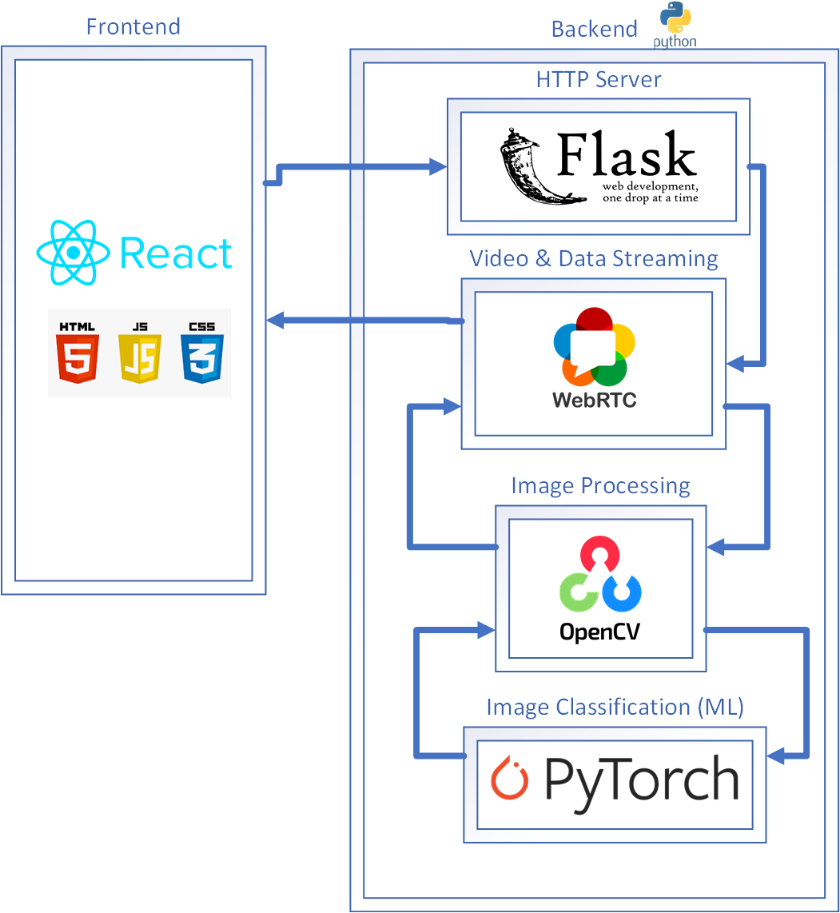

# RockHand Backend!

## How to set us up? ⚡

`pip install -r requirements.txt`

## How to build model?

`python train.py`
then `python evaluate.py`

Tune hyperparameters in training/evaluation to change model

## How to run?

`python server.py --port 8081`

## How to use?

go to `localhost:8081`

## About

You can run from just flask too!

## References

- https://www.digitalocean.com/community/tutorials/how-to-build-a-neural-network-to-translate-sign-language-into-english
- https://devpost.com/software/rockhand-asl-new-continuous-learning-for-accessibility
